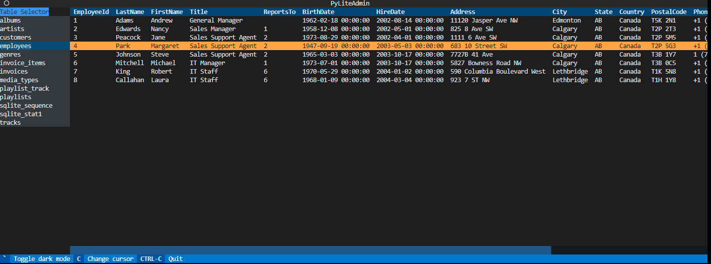

# PyLiteAdmin

PyLiteAdmin is a Python app for viewing and editing sqlite databases with an appealing and useful interface. All inside of the terminal thanks to the [Textual](https://pypi.org/project/textual/) framework.

## Features
- [x] Use a TUI (Terminal User Interface) to view your sqlite database
- [ ] Search Columns (TODO)
- [ ] Add/Delete Rows (TODO)
- [ ] Edit Cell values (TODO)


## Usage

```bash
$ python pyliteadmin.py <path to database>

# example using included database:
$ python pyliteadmin.py ./chinook.db
```



Use the "Table Selector" on the left side of the terminal window to select which table you would like to view.

## Contributing

Pull requests are welcome. For major changes, please open an issue first
to discuss what you would like to change.

## License

[Apache License 2.0](https://choosealicense.com/licenses/apache-2.0/)
