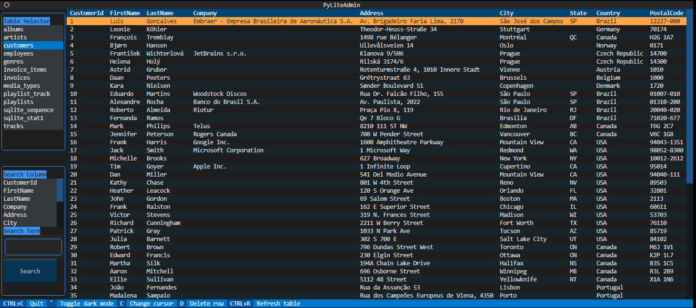

# PyLiteAdmin

PyLiteAdmin is a simple command-line tool for browsing and editing SQLite databases, written in Python. It provides a user interface for viewing tables, searching for data, and performing basic CRUD (Create, Read, Update, Delete) operations. All inside of the terminal thanks to the [Textual](https://pypi.org/project/textual/) framework.
***
## Features
- [x] Use a TUI (Terminal User Interface) to view your sqlite database
- [x] Search Columns
- [x] Delete Rows
- [x] Add Rows
- [x] Edit Cell values

***

## Usage

```bash
python pyliteadmin.py /path/to/database.db
```

Using the included database:
```bash
python pyliteadmin.py ./chinook.db
```
This will start the PyLiteAdmin interface, which consists of three main components:

- Table Selector: allows you to select a table from the database.
- Table Viewer: displays the contents of the selected table.
- Table Search: allows you to search for data within the selected table.


*You may need to expand your terminal window to make all of the elements fit*

Use the Table Selector on the top left side of the terminal window to select which table you would like to view.

Use the "Search Column" widget on the bottom left side of the terminal window to search for a specific search term on the selected column. Returns a new table view with all matching/similar rows.

***
## Contributing

Pull requests are welcome. For major changes, please open an issue first
to discuss what you would like to change.

***
## License

[Apache License 2.0](https://choosealicense.com/licenses/apache-2.0/)
